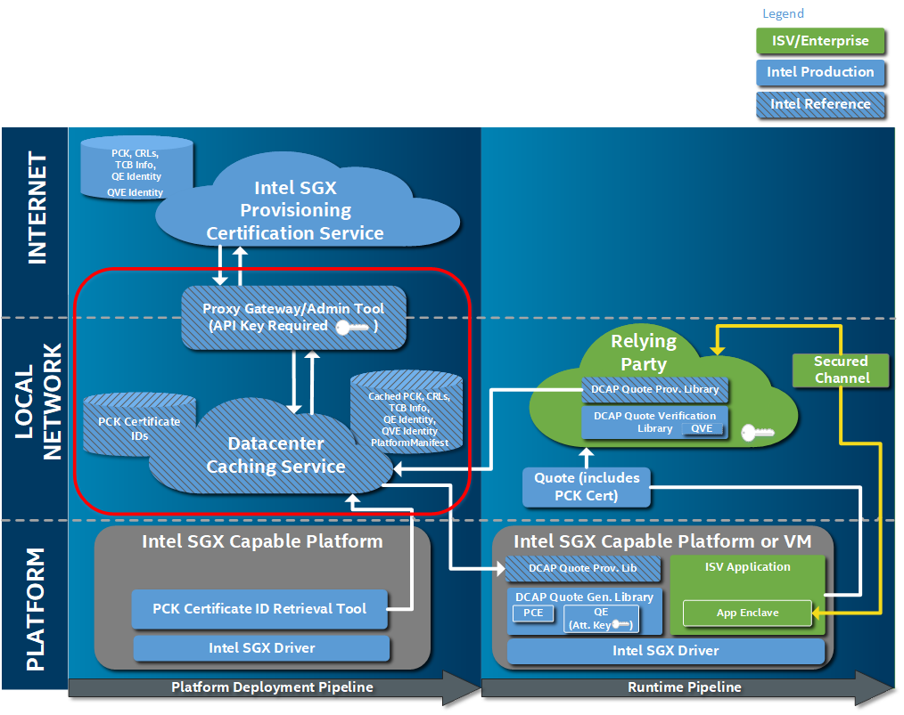
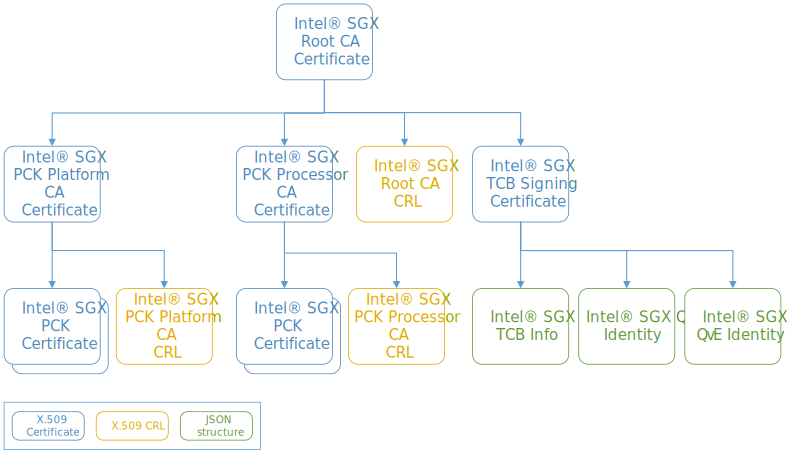

<!---
Copyright (C) 2025 Intel Corporation
SPDX-License-Identifier: CC-BY-4.0
-->

# Overview

Intel provides a reference Quote Provider Library (QPL) and a reference Intel® SGX and Intel® TDX Provisioning Certificate Caching Service (PCCS) to enable SGX-based attestation of Intel SGX enclaves and Intel TDX TDs without a dependence on the Intel® services.
Intel® SGX and Intel® TDX Data Center Attestation Primitives (DCAP) also provides the network interface layer called PCK Certificate Collateral Network Library (QCNL).
The libraries and the PCCS interaction with the Intel® SGX and Intel® TDX Provisioning Certification Service (PCS) can be configured in a number of ways to fit the customer's attestation infrastructure.

This document covers the high-level design details for the PCCS.

## Architecture Overview – ECDSA-Based Data Center Attestation

The proposed architecture centers around a caching service that maintains the Intel® SGX attestation collateral for all servers at a CSP or in any other data center.
The services provides that collateral to servers for quote generation and quote verification.
This document describes the PCCS RESTful APIs and the tools needed to get the attestation collateral into the PCCS for Intel® SGX-enabled server platforms.
It also describes the RESTful APIs exposed to platforms to retrieve that collateral during runtime.

{ width="800px" }
/// figure-caption
    attrs: {id: img_intel_sgx_dcap_architecture_diagram}
Intel® SGX and Intel® TDX DCAP Architecture Diagram
///

## Intel® SGX ECDSA Public Key and Data Structure Hierarchy

The figure below shows the relationship between the SGX Attestation collateral (keys and data structures) used for Intel® SGX ECDSA Quote Generation and Quote Verification.
This collateral is generated and signed by Intel and stored in the PCS.

{ width="800px" }
/// figure-caption
    attrs: {id: img_intel_sgx_ecdsa_public_key_and_data_structure}
Intel® SGX ECDSA Public Key and Data Structure Hierarchy
///
