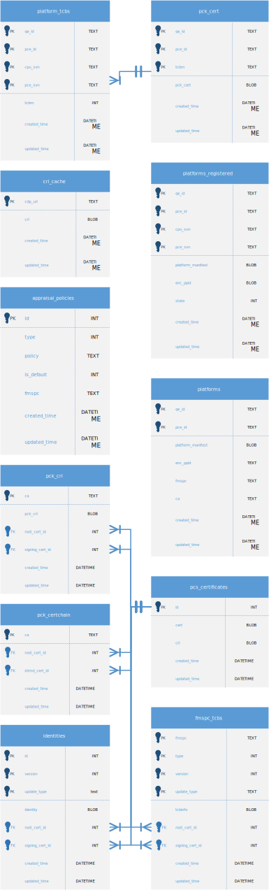

<!---
Copyright (C) 2025 Intel Corporation
SPDX-License-Identifier: CC-BY-4.0
-->

# Database


## Schema Definition

{ width="800px" }
/// figure-caption
    attrs: {id: img_image4, class: l1}

PCCS Database Schema Definition
///


### `pck_cert`

:   Cache table for all PCK Certificates of platforms.
    A **{qe_id, pce_id}** pair uniquely identifies a platform.
    There should be only one valid PCK Certificate for certain TCBm of the platform.


### `platform_tcbs`

:   Stores the raw TCB to TCBm mapping.


### `platforms`

:   Stores information of a specific platform identified by {qe_id, pce_id}.


### `pck_crl`

:   Cache table for PCK CRL.


### `fmspc_tcbs`

:   Cache table for TCB Info.


### `identities`

:   Cache table for Enclave and TD Identities – QE, QVE, and TD QE.

::spantable:: class="st-w100p"

| **ID(PK)** @class="w021p" | **Description** @class="w079p" |
| --- | --- |
| 1 | QE Identity |
| 2 | QVE Identity |
| 3 | TD QE Identity |

::end-spantable::

/// table-caption
    attrs: {id: tab_table32, class: l1}

///


### `pcs_certificates`

::spantable:: class="st-w100p"

| **ID(PK)** @class="w021p" | **CERT** @class="w016p" | **CRL** @class="w016p" | **Description** @class="w047p" |
| --- | --- | --- | --- |
| 1 | BLOB | BLOB | Processor Root CA |
| 2 | BLOB | BLOB | Processor Intermediate CA |
| 3 | BLOB | BLOB | TCB Signing CA |
| 4 | BLOB | BLOB | Platform Intermediate CA |

::end-spantable::

/// table-caption
    attrs: {id: tab_table33, class: l1}

///


### `platforms_registered`

:   Registration table for platforms.


### `pck_certchain`

:   Cache table for PCK certificate chain IDs.

::spantable:: class="st-w100p"

| **ca(PK)** @class="w021p" | **root_cert_id** @class="w017p" | **intmd_cert_id** @class="w020p" | **Description** @class="w042p" |
| --- | --- | --- | --- |
| PROCESSOR | 1 | 2 |  |
| PLATFORM | 1 | 4 |  |

::end-spantable::

/// table-caption
    attrs: {id: tab_table34, class: l1}

///


## Data Access Objects


### platformsDao

`upsertPlatform(qe_id, pce_id, platform_manifest, enc_ppid, fmspc,ca)`

:   Inserts into or updates platforms table with `{qe_id, pce_id, platform_manifest, enc_ppid, fmspc,ca}`.

`getPlatform(qe_id, pce_id)`

:   Searches for a single platform instance by the `{qe_id, pce_id}` key pair.

`updatePlatform(qe_id, pce_id, platform_manifest, enc_ppid)`

:   Updates a single record of platforms table identified by the `{qe_id, pce_id}` key pair with new `platform_manifest` and `enc_ppid` values.

`getCachedPlatformsByFmspc(fmspc_arr)`

:   The input `fmspc_arr` is an array of fmspc values.
    This function queries all cached platforms based on the fmspc array.

    ``` { .text }
    select a.qe_id, a.pce_id, b.cpu_svn, b.pce_svn,
        a.enc_ppid, a.platform_manifest
    from platforms a, platform_tcbs b where a.qe_id=b.qe_id
        and a.pce_id = b.pce_id and a.fmspc in (:fmspc_arr)
    ```


### pckcertDao

`getCert(qe_id, cpu_svn, pce_svn, pce_id)`

:   Queries PCK Certificate and PCK certificate chain based on the input keys.

    ``` { .text }
    select b.*,
        (select cert from pcs_certificates e where e.id=d.root_cert_id)
            as root_cert,
        (select cert from pcs_certificates e where e.id=d.intmd_cert_id)
            as intmd_cert
    from platform_tcbs a, pck_cert b, platforms c left join pck_certchain d on c.ca=d.ca
    where a.qe_id=$qe_id and a.pce_id=$pce_id and a.cpu_svn=$cpu_svn
        and a.pce_svn=$pce_svn and a.qe_id=b.qe_id and a.pce_id=b.pce_id
        and a.tcbm=b.tcbm and a.qe_id=c.qe_id and a.pce_id=c.pce_id
    ```

`getCerts(qe_id, pce_id)`

:   Queries all PCK Certificates associated with the input `qe_id` and `pce_id`.

`upsertPckCert(qe_id, pce_id, tcbm, cert)`

:   Inserts into or updates `pck_cert` table with the input parameters.

`deleteCerts(qe_id, pce_id)`

:   Deletes all records associated with `{qe_id, pce_id}` from `pck_cert` table.


### fmspcTcbDao

`upsertFmspcTcb(tcbinfoJson, update_type)`

:   Inserts into or updates `fmspc_tcbs` table with the input tcbinfoJson:

::spantable:: class="st-w100p"

| **Target Field** @class="w044p" | **Value** @class="w056p" |
| --- | --- |
| type | tcbinfoJson.type |
| fmspc | tcbinfoJson.fmspc |
| update_type | update_type |
| version | tcbinfoJson.version |
| tcbinfo | tcbinfoJson.tcbinfo |
| root_cert_id | 1 |
| signing_cert_id | 3 |

::end-spantable::

/// table-caption
    attrs: {id: tab_table36, class: l1}

///

`getTcbInfo(type, fmspc, version, update_type)`

:   Queries TCB Info and TCB Info issuer chain for given fmspc

    ``` { .text }
    select a.*,
        (select cert from pcs_certificates where id=a.root_cert_id)
            as root_cert,
        (select cert from pcs_certificates where id=a.signing_cert_id)
            as signing_cert
    from fmspc_tcbs a where a.type=$type and a.fmspc=$fmspc
        and a.update_type=$update_type and a.version=$version
    ```

`getAllTcbs()`

:   Queries all TCB Info records from `fmspc_tcbs` table.


### pckCertchainDao

`upsertPckCertchain(ca)`

:   Inserts into or updates pck_certchain table with the below record:

    `{id:1, root_cert_id:1, intmd_cert_id:2 for processor CA and 4 for platform CA}`

`getPckCertchain (ca)`

:   Queries PCK Certificate issuer chain for the input `ca`:

    ``` { .text }
    select a.*,
        (select cert from pcs_certificates where id=a.root_cert_id)
            as root_cert,
        (select cert from pcs_certificates where id=a.intmd_cert_id)
            as intmd_cert
    from pck_certchain a
    where a.ca=$ca
    ```


### pckcrlDao

`getPckCrl(ca)`

:   Queries PCK CRL and PCK CRL certificate chain for given `ca`.

    ``` { .text }
    select a.*,
        (select cert from pcs_certificates where id=a.root_cert_id)
            as root_cert,
        (select cert from pcs_certificates where id=a.intmd_cert_id)
            as intmd_cert
    from pck_crl a
    where a.ca=$ca
    ```

`upsertPckCrl(ca, crl)`

:   Inserts into or updates `pck_crl` table with the input `ca` and `crl`:

::spantable:: class="st-w100p"

| **Target Field** @class="w027p" | **Value** @class="w073p" |
| --- | --- |
| ca | The input ca value |
| pck_crl | The input crl value |
| root_cert_id | 1 |
| intmd_cert_id | 2 for processor CA and 4 for platform CA |

::end-spantable::

/// table-caption
    attrs: {id: tab_table37, class: l1}

///


### pcsCertificatesDao

`upsertPcsCertificates(pcsCertJson)`

:   Inserts into or updates `pcs_certificates` table with the pcsCertJson object, which can be mapped to one record of the table.

`upsertPcsCertificates(id, cert)`

:   Inserts into or updates `pcs_certificates` table with the input id and cert values.

`upsertPckCertificateIssuerChain(ca, pck_certchain)`

:   Splits the input `pck_certchain` into SGX Intermediate CA Certificate and SGX Root CA Certificate, then updates/inserts them into `pcs_certificates` table.
    When `ca` is `processor`, use `2` for `pcs_certificates.id`, when `ca` is `platform`, use `4` for `pcs_certificates.id`.

`upsertPckCrlCertchain(ca, pck_crl_certchain)`

:   Splits the input `pck_crl_certchain` into SGX Intermediate CA Certificate and SGX Root CA Certificate, then updates/inserts them into `pcs_certificates` table.
    When `ca` is `processor`, use `2` for `pcs_certificates.id`, when `ca` is `platform`, use `4` for `pcs_certificates.id`.

`upsertTcbInfoIssuerChain(tcbinfo_certchain)`

:   Splits the input `tcbinfo_certchain` into SGX TCB Signing Certificate and SGX Root CA Certificate, then updates/inserts them into `pcs_certificates` table.

`upsertIdentityIssuerChain(identity_certchain)`

:   Splits the input `enclave_identity_certchain` into SGX Enclave Signing Certificate and SGX Root CA Certificate, then updates/inserts them into `pcs_certificates` table.


`getCertificateById(ca_id)`

:   Finds a single instance identified by the `ca_id` from `pcs_certificates` table.

`upsertRootCACrl(rootcacrl)`

:   Updates the root certificate `CRL(id=1)` in `pcs_certificates` table.


### platformsRegDao

`findRegisteredPlatform(regDataJson)`

:   Searches a single instance from platforms_registered table by `{regDataJson}`.

`findRegisteredPlatform()`

:   Finds all records whose status are NEW from platforms_registered table.

`registerPlatform(regDataJson, state)`

:   Adds a new record to platforms_registered table with the values in `regDataJson` and the `state` parameter.

`deleteRegisteredPlatforms()`

:   Updates all records with NEW state to DELETED state.


### platformTcbsDao

`upsertPlatformTcbs(qe_id, pce_id, cpu_svn, pce_svn, tcbm)`

:   Inserts into or updates `platform_tcbs` table with the input parameters.

`getPlatformTcbs(fmspc)`

:   Gets all cached `platform_tcbs` for the input `fmspc`.
    It also needs to return the enc_ppid value.
    If `fmspc` is null, then all cached `platform_tcbs` are returned.

    ``` { .text }
    select a.*,b.enc_ppid as enc_ppid
    from platform_tcbs a, platforms b where a.qe_id=b.qe_id
        and a.pce_id=b.pce_id and b.fmspc=$fmspc
    ```

`getPlatformTcbsById (qe_id, pce_id)`

:   Gets all records associated with the input `qe_id` and `pce_id` from `platform_tcbs` table.


### identityDao

`upsertIdentity(id, identity, update_type, version)`

:   Updates or inserts into `identities` table.

::spantable:: class="st-w100p"

| **Target Field** @class="w035p" | **Value** @class="w065p" |
| --- | --- |
| id | The input id parameter |
| update_type | update_type |
| version | The input version parameter |
| identity | The input identity parameter |
| root_cert_id | 1 |
| signing_cert_id | 3 |

::end-spantable::

/// table-caption
    attrs: {id: tab_table38, class: l1}

///

`getIdentity(id, version)`

:   Gets the identity and identity issuer chain from `identities` and `pcs_certificates` table.

    ``` { .text }
    select a.*,
        (select cert from pcs_certificates where id=a.root_cert_id)
            as root_cert,
        (select cert from pcs_certificates where id=a.signing_cert_id)
            as signing_cert
    from identities a
    where a.id=$id and a.update_type=$update_type and a.version=$version
    ```


### crlCacheDao

`upsertCrl (cdp_url, crl)`

:   Updates or inserts into `crl_cache` table.

::spantable:: class="st-w100p"

| **Target Field** @class="w060p" | **Value** @class="w040p" |
| --- | --- |
| cdp_url | cdp_url |
| crl | crl |

::end-spantable::

/// table-caption
    attrs: {id: tab_table39, class: l1}

///

`getCrl(cdp_url)`

:   Gets the CRL for the specified `cdp_url`.

`getAllCrls()`

:   Get all cached CRLs.


### appraisalPolicyDao

`upsertAppraisalPolicy(apJson)`

:   Updates or inserts into `appraisal_policies` table.

::spantable:: class="st-w100p"

| **Target Field** @class="w038p" | **Value** @class="w062p" |
| --- | --- |
| id | Sha384(apJson.policy) |
| type | Type of the policy |
| policy | apJson.policy |
| Is_default | apJson.is_default |
| fmspc | apJson.fmspc |

::end-spantable::

/// table-caption
    attrs: {id: tab_table40, class: l1}

///

`getDefaultAppraisalPolicies(fmspc)`

:   Gets the default policy for the `fmspc` from `appraisal_policies` table.

    ``` { .text }
    AppraisalPolicy.findAll({
        where: {
            is_default: true,
            fmspc: fmspc
        },
        attributes: ['policy']
    })
    ```
