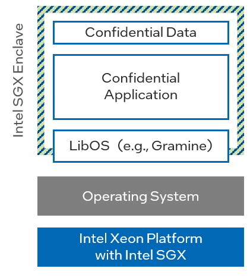
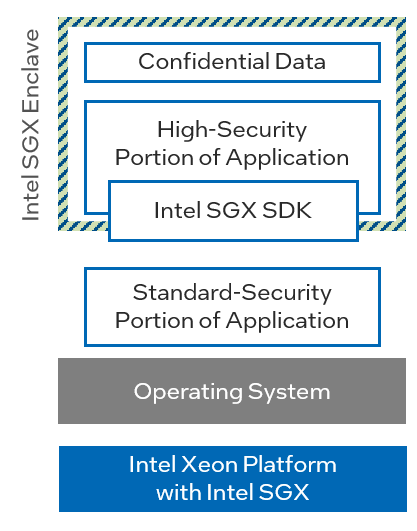

# Main Intel SGX Application Architectures

Applications that use Intel SGX generally come in two forms:

1. **Applications developed using a Library OS such as Gramine or Occlum.** In this case, the Library OS (LibOS) abstracts the application code from the Intel SGX APIs and function calls.
  In theory, the application could successfully run outside an Intel SGX enclave with little or no modification.
  This architecture was often used to port non-native Intel SGX applications into an enclave.

    { width="220px" height="245px" }
    /// figure-caption
        attrs: {id: img_intel_sgx_application_with_library_os}
    Intel SGX Application with Library OS
    ///

2. **Applications natively coded for Intel SGX using the Intel SGX SDK or comparable tools such as Open Enclave SDK.** These applications directly call Intel SGX functions and APIs facilitated by the SDK.
  They were specifically developed to operate inside an Intel SGX enclave and cannot successfully operate outside without modifications.

    { width="230px" height="296px" }
    /// figure-caption
        attrs: {id: img_intel_sgx_application_built_with_intel_sgx_sdk}
    Intel SGX Application Built with Intel SGX SDK
    ///

This distinction matters because the migration approach differs substantially.
If the Intel SGX application is built using a Library OS, potential migration options are described in the chapter [Transitioning Applications Based on a Library OS](../03/libos_transition_options.md).
If the application is natively built with the Intel SGX SDK or comparable tools, potential migration options are described in the chapter [Transitioning Applications Based on the Intel SGX SDK](../04/sgx_sdk_transition_options.md).
