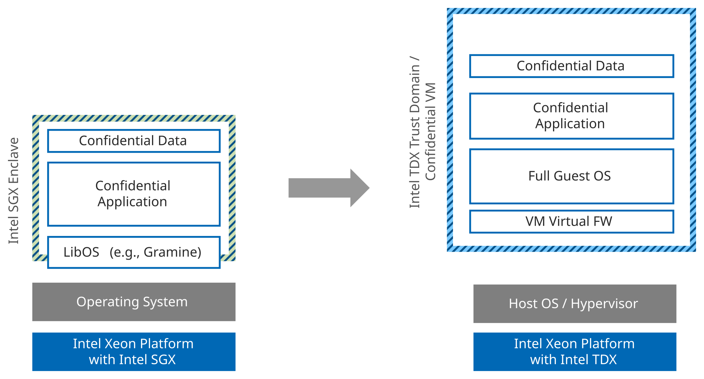
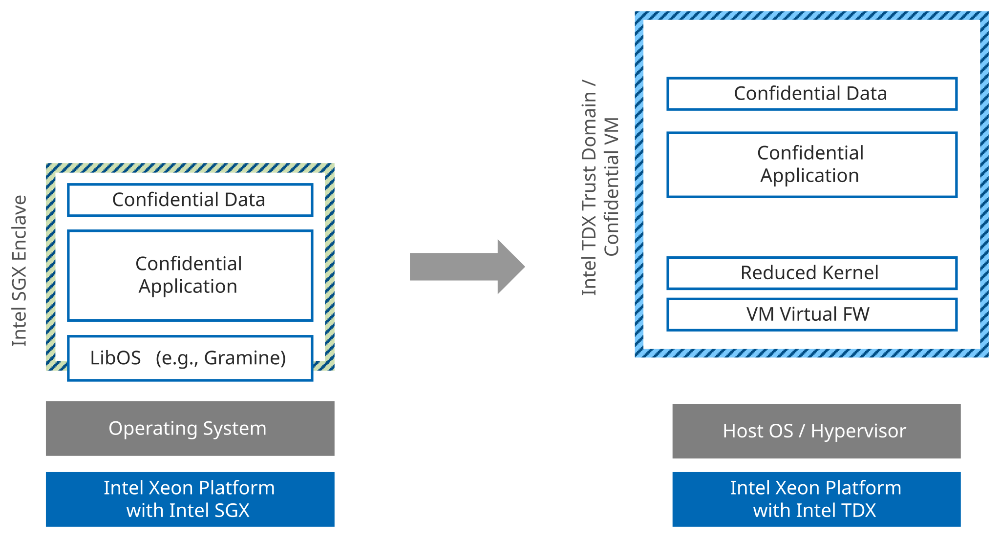
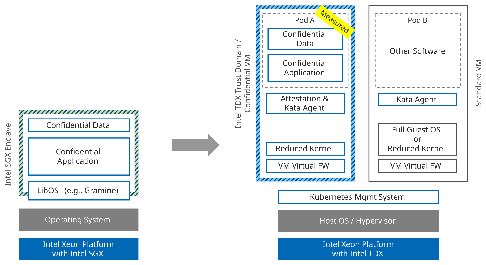

# Transitioning Applications Based on a Library OS

From a functionality perspective, applications that use a Library OS (LibOS) should be relatively straightforward to port to an Intel TDX environment.
Since the LibOS intermediates Intel SGX APIs and function calls, these applications can normally run standalone outside an enclave, including in an Intel TDX Confidential VM (CVM).

Note that some LibOSes provide convenience functionalities for enclaves, e.g., automatic encryption/decryption of files or automatic attestation.
These functionalities have to be replaced when separating the application from LibOS.
In the remainder of this section, we assume that this process was done.

## Option A1

The most straightforward option is to provision the application inside an ordinary Intel TDX-protected CVM with a full-featured Guest OS.
This is close to a "lift and shift" transition, with a possible validation cycle to confirm the application is compatible with the Intel TDX-enabled Guest OS.

Although straightforward, the TCB in this option is much larger compared to an Intel SGX enclave as it includes the CVM's virtual firmware and the entire Guest OS.
These components may be orders of magnitude more code than the application itself.
The authenticity and integrity of the CVM can be attested by Intel TDX, but Intel TDX does not natively attest the integrity of applications running inside the CVM.
Additional development or service integrations would be required to attest the application(s).

/// figure-caption
    attrs: {id: img_port_confidential_application_to_cvm}
Port the Confidential Application to a CVM
///

## Option A2

In this option, the developer reduces the TCB by minimizing the code size of the Guest OS.
An Intel TDX-enabled, minimal Linux kernel could be acquired or built that includes only the necessary functions for the application if a full-featured enterprise Linux OS is not required.

This option reduces the TCB versus [Option A1](#option-a1), but it doesn't inherently offer attestation of the application inside the CVM.
This capability would require additional development or service integration.

/// figure-caption
    attrs: {id: img_port_confidential_application_to_cvm_with_reduced_kernel}
Port the Confidential Application to a CVM with a Reduced Kernel
///

## Option A3

This option more closely replicates the small TCB and granular software attestation of Intel SGX using the open-source [Confidential Containers (CoCo)](https://confidentialcontainers.org/) project.
Building on Kata Containers and related attestation components, CoCo enables confidential container workloads in Kubernetes, with each pod running inside its own CVM.
In this model, the application is packaged as a container image within a pod, and CoCo can combine guest CVM attestation with policy-based verification of signed or encrypted container images.
After successful attestation, secrets such as decryption keys or certificates can be released to the workload according to policy, while access control can still be applied at a fine-grained level.
Like [Option A2](#option-a2), the guest OS could be a dedicated, reduced OS for cloud native workloads to reduce the TCB.

This option offers a smaller TCB compared to [Option A1](#option-a1), together with advanced access control and a stronger attestation and policy framework for containerized workloads.
On top of the open-source CoCo project, Red Hat offers a productized version with Red Hat OpenShift Confidential Containers.
Additionally, Edgeless Systems' "Contrast" follows a similar architecture.

/// figure-caption
    attrs: {id: img_porting_confidential_application_to_attested_confidential_container}
Porting the Confidential Application to an Attested Confidential Container
///
