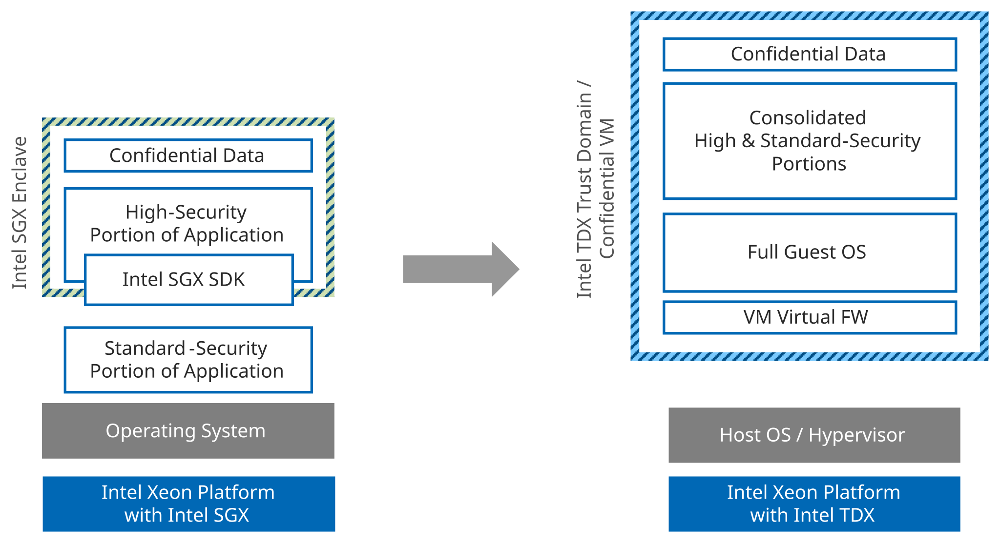
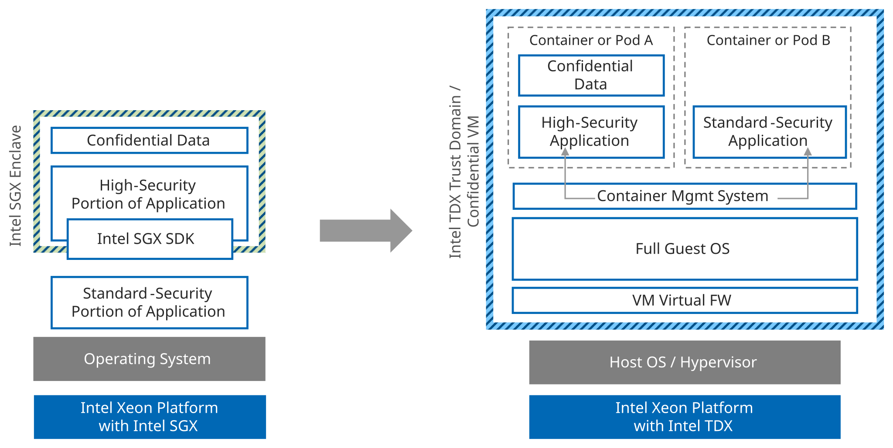

# Transitioning Applications Based on the Intel SGX SDK

Applications based on the Intel SGX Software Development Kit (SDK) or similar SDKs are coded specifically for Intel SGX enclaves.
The application natively calls Intel SGX APIs and functions without any abstraction layer such as a Library OS.
Consequently, porting them into a non-SGX environment will require a new architecture and significant code modifications.

Intel SGX SDK-based applications are usually divided between a "standard security" portion, that runs outside the Intel SGX enclave, and one or more "high security" portions that process confidential data inside SGX enclaves.
Some documentations call these "untrusted" and "trusted" parts.
Developers that use the Intel SGX SDK must decide whether to combine the high- and standard-security portions into a unified application or maintain the two-tier segmentation.
[Option B1](#option-b1) explores unification, while [Option B2](#option-b2) proposes a solution that maintains the segmentation.

## Option B1

In this case, the developer unifies the "standard-security" and "high-security" portions into a single application and protects it inside an Intel TDX Confidential VM.

To execute this strategy, the developer removes the "glue code" that connects the high- and standard-security portions and removes calls to Intel SGX-native APIs and functions enabled by the Intel SGX SDK.
This includes code defined in Enclave Definition Language (EDL) and generated by the Edger8r.
The developer may choose to use other programming techniques to limit access to the high-security portion of the unified application, but any separation is software-based.
The resulting unified application can then be deployed into an Intel TDX Confidential VM, similar to [Option A1](../03/libos_transition_options.md#option-a1).
If a smaller TCB is desired, the unified application could be deployed using a reduced, simplified kernel as in [Option A2](../03/libos_transition_options.md#option-a2) or [Option A3](../03/libos_transition_options.md#option-a3).

/// figure-caption
    attrs: {id: img_consolidating_all_parts_into_one_unified_application_in_cvm}
Consolidating All Parts into One Unified Application in a CVM
///

## Option B2

In this option, the developer retains the segmented "standard-security" and "high-security" architecture, but each portion is modified into a standalone application and deployed in a container or pod inside an Intel TDX Confidential VM.

As in option B1, the developer removes the "glue code" between the high- and standard-security portions and removes all native calls to Intel SGX APIs and functions.
The resulting standalone applications are placed in their own containers (or pods if using Kubernetes).
Communication and access between standard- and high-security containers/pods can be restricted on the network level and container/pod access permissions via the associated Container Management System.

This option separates high- and standard-security functions, even if the separation is only software-enforced.
The TCB of this option is larger than option B1, due to the introduction of the Container Management System inside the Confidential VM.
Attestation is limited to the integrity of the Confidential VM, and attestation of the software inside the VM would require additional development or service integration.
However, this option preserves security-based separation versus a unified application, but that isolation is only software-enforced.

/// figure-caption
    attrs: {id: img_segmenting_application_using_containers_and_restricted_access_policies}
Segmenting Application Using Containers and Restricted Access Policies
///

To conclude, developers have a range of options to transition Intel SGX-based applications to an Intel TDX environment.
The best choice is a function of the starting point (LibOS or SDK), desired security characteristics of the transitioned application, and resources available to support the effort.
