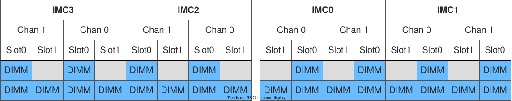
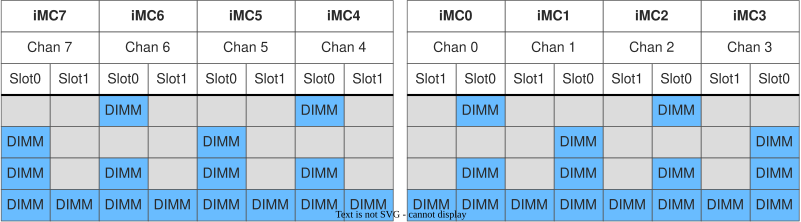
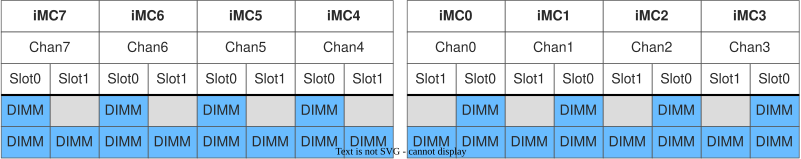
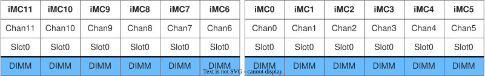

<!---
Copyright (C) 2024 Intel Corporation
SPDX-License-Identifier: CC-BY-4.0
-->

# Hardware Selection

On this page, we will explain what hardware is needed to enable Intel TDX.
This encompasses CPU requirements and DIMM requirements.
In most cases, the infrastructure provider is responsible for selecting the appropriate platform hardware.
Please talk to your OEM/ODM provider to receive a platform fulfilling the listed requirements.

## CPU Requirements

To enable Intel TDX, one of the following processor families is required:

- [5th Gen Intel® Xeon® Scalable Processor](https://www.intel.com/content/www/us/en/ark/products/series/236644/5th-gen-intel-xeon-scalable-processors.html)
- [Intel® Xeon® 6 Processors](https://www.intel.com/content/www/us/en/ark/products/series/240357/intel-xeon-6.html)

## DIMM (i.e., main memory) Requirements

In this section, we present DIMM populations supported for Intel TDX across various CPU generations.
In a multi-socket system, each populated CPU must follow the presented DIMM populations.

!!! Note
    The supported DIMM populations are presented for informational purposes only.
    Please refer to the OEM/ODM documentation of your system, as the specific platform implementation may vary.

### 4th Gen Intel® Xeon® Scalable Processor and 5th Gen Intel® Xeon® Scalable Processor

At minimum, all slot 0's of all Integrated Memory Controller (IMC) channels for all installed CPUs must be populated (i.e., 8 DIMMs per populated CPU socket, at least).
DIMM population must be symmetric across IMCs.

/// figure-caption
Supported DIMM populations per populated CPU for 4th Gen Intel® Xeon® Scalable Processor and 5th Gen Intel® Xeon® Scalable Processor
///

### Intel® Xeon® 6700/6500-Series Processors with P-Cores > 16 cores

/// figure-caption
Supported DIMM populations per populated CPU for Intel® Xeon® 6700/6500-Series Processors with P-Cores > 16 cores
///

### Intel® Xeon® 6700/6500-Series Processors with P-Cores <= 16 cores

/// figure-caption
Supported DIMM populations per populated CPU for Intel® Xeon® 6700/6500-Series Processors with P-Cores <= 16 cores
///

### Intel® Xeon® 6700-Series Processor with E-Cores

/// figure-caption
Supported DIMM populations per populated CPU for Intel® Xeon® 6700-Series Processor with E-Cores
///

### Intel® Xeon® 6900-Series Processors with P-Cores, Intel® Xeon® 6900-Series Processor with E-Cores, and Intel® Xeon® 6+ with E-cores

/// figure-caption
Supported DIMM population per populated CPU for Intel® Xeon® 6900-Series Processors with P-Cores, Intel® Xeon® 6900-Series Processor with E-Cores, and Intel® Xeon® 6+ with E-cores
///
